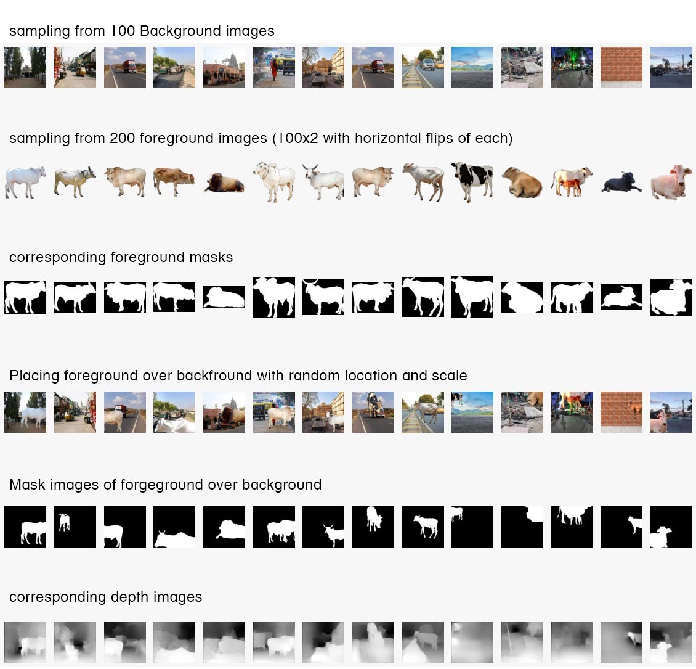
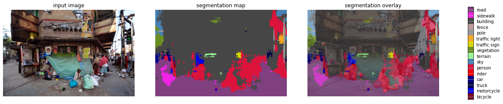
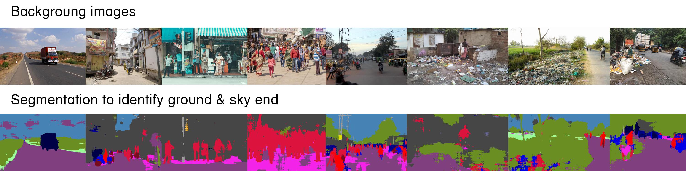
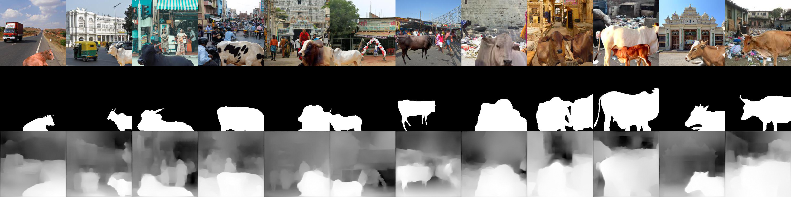
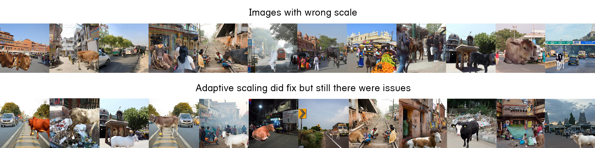
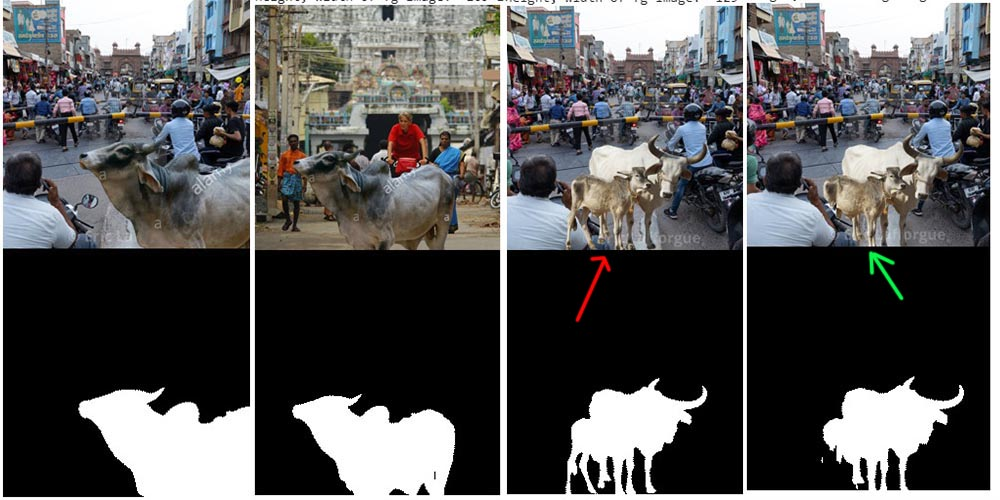

# S14/15A - Data Preparation

## Kinds of images and total counts

* 100 images of outdoor background scenes mostly with roads and fields both empty and populated. These are all landscape images.
* 100 foreground transparent images of cow/bull/calf and also extended them to 200 by flipping each horizontally (making them 200)
* We then randomly placed each foreground on each background 20 times making 400K images each of 224x224 resolution. 
* for each image we generated corresponding mask and depth image of same resolution.

## Size of dataset

* Total size is 6GB zipped and 8GB unzipped with each image approximately 7KB, each mask/depth approx 2KB. 
* While images are jpeg RGB with 60% quality, mask is binary and depth is grayscale image (both jpgs again with 60% quality).

## Dataset

### Links to dataset
* foreground images [here](https://drive.google.com/drive/folders/1ZXqTNZEx_oM2oBR-i6I99WeagOlO9DAv?usp=sharing)
* background images [here](https://drive.google.com/drive/folders/1yQG1D513ITs77rXNI0rVPcDCu0jmBvbT?usp=sharing)
* mask images [here](https://drive.google.com/drive/folders/1xiW7NI_85_WU2h6NIDCfEEGqdZT2Ujek?usp=sharing)
* zipfile for generated dataset [here](https://drive.google.com/file/d/1E4tZL5sq66RwGTzfAv3iws-gJDgwOLvM/view?usp=sharing)


###  Top-level layout of the dataset (Directory Structure)
```
|---custom_data
    |---bgimages                  # contains 100 background images
    |---foreground                # contains 100 foreground png imags and images produced by flipping them (200)
    |---masks                     # contains 200 masks for the above foreground images
    |---output
        |---fgbg                  # 400000 images produced by overlaying every fg 20 times on bg                 
        |---masks                 # 400000 respective masks of the fgbg images
        |---masks                 # 400000 respective depth images of fgbg images
```

## Data Statistics

| Type of Image | Total | Mean | Standard Deviation |
| :---: | --- | --- | --- |
| `fg_bg` | 400000 | ( 0.50610699, 0.5250236, 0.51219183 ) | ( 0.28525343, 0.24801724, 0.24747186 ) |
| `mask` | 400000 | ( 0.13532567, ) | ( 0.33999708, )  |
| `depth` | 400000 | ( 0.57016144, ) | ( 0.25914387, ) |


## Sample images




## Process of Image Generation

### Background Images
We downloaded 100 images of background of streets, roads, and landscapes. We did a maximal random crop of 448x448 without affecting the image aspect.

### Foreground Images
We downloaded a lot of images that were already transparent png's. However several were pseudo png's i.e. the background was white. We used Photoshop's magic wand to select that region and make it transparent. However we were still short of 40+ images. We then downloaded several images of cows/calf/bull and used [remove.bg](https://www.remove.bg/) that uses a combination of Image based techniques and DNN to separate foreground from background. It gave very good results. However for several we still have to use lasso tool in Photoshop to make the foregrounds really stand out.

### Depth Calculation
We used nyu.h5 model for depth calcualtion from [dense depth](https://github.com/ialhashim/DenseDepth). This model requires input images to be of 448x448 resolution and produces 224x224 size depth image. We planned to run it with a batch of 1000.

### FG-BG Image Generation
We planned to pass 2000 images in a single batch to the Depth image generator. Since 1 background will have 2000 images with 100 foregrouds (each 20 times) and another 2000 for same foreground images flipped, we ran the batch twice, second time with foregrounds flipped.

Below is the process for one batch. 
**NOTE**: We did not separately save corresponding bg, since the way we processed the image, from the image number we can determing the bg image number that we used.

```
INPUT bg image, list of fg images
1 for each foreground in list
  1.1 repeat 20 times
    1.1.1. randomly pick a center point on image (two numbers in range 0 to 447 for x, y)
    1.1.2. randomly pick a scale between .3 and .6 indicating how much square area should fg overlap on bg
    1.1.3. resize the fg to scale and place it on top of bg centered at x, y calculated
    1.1.4. save it at 224x224 resolution in a zip folder
    1.1.5. calculate mask by setting a binary image to transparency channel of fg image, with trasparent = 0 amd non transparent=1
    1.1.6. save mask at 224x224 resolution
    1.1.7. add 448x448 image to numpy array for depth calculation
1.3 if 100 images generated then yield the batch
  
2. run depth for one batch
3. save depth images of 224x224 in zipfolder
```

### Mask calculation
We found that not all transparent images were precise. There were images with semi transparency round edges. So we took the transparency channel and made it in range 0 to 255. Then we set mask = 0 for transparency < 200 and mask = 1 for transparency >=200. This gave us good binary mask.

### Stats calculation
Ideally we could have calculated mean/stdev in our generator, but we **FORGOT** to do that, hence have to write another script to calculate the same. We used inceremental mean / standard deviation calculation after normalizing the image to 0,1 range. This way we did not exceed the float limits for 400K images.

## Links to ipynb files

* [Data generator](https://github.com/abhinavdayal/EVA4/blob/master/S14/Final_Data_Creation.ipynb)
* [Statistics Calculator](https://github.com/abhinavdayal/EVA4/blob/master/S14/MeanandSD.ipynb)

# Real-time adaptive Placement with Segmentation Experiment

We initially thought that we should create realistic images, and our cows should be properly scaled and not flying in sky. To this end we spent almost one week. Later it was clarifid in last weeks session that we should not do that. Moreover we are supposed to have fixed 100 bg images. In this experiment we are randomly cropping a square region of BG instead.

Still, the process was nice and we would like to document the same.

* We used Segmentation from [this colab](https://colab.research.google.com/github/lexfridman/mit-deep-learning/blob/master/tutorial_driving_scene_segmentation/tutorial_driving_scene_segmentation.ipynb)
* For our background images it gave results like shown below



Our initial BG images with degmentation and depths can be found [here](https://drive.google.com/open?id=1ZLqkr_oY4xGK-Vhdvjr_BLGVEewcEsi3).

* We decided to use terrain, road and sidewalk regions only to place the foreground (cow).
* we also calculated the last row where sky was present. We rejected all ground pixels above the sky
* as a precaution we also hard limited sky to 50% of the height of image.
* We observed that our background images are all different in terms of camera parameters but they were all perspective projections from a person on ground view mostly. So we manually wrote a scaling factor (*ADAPTIVE SCALING*) for each background suggesting a linear interpolation from a large scale at bottom to a smaller scale at horizon. By scale we mean the fraction of area of background that a foreground image must occupy. [Here](https://drive.google.com/open?id=1ILVEydlrXIJ0H6q74fedP7PfUi2X5tXD) is the scale file.
* That is it! Our initial algorithm was simple

Our final code can be found [here](https://github.com/abhinavdayal/EVA4/blob/master/S14/Segmentation_Based_Data_Creation.ipynb).

```
1. Repeat 400K times
  1.1 Pick a bg image at random from 100 images
  1.2 pick a fg image at random from 100 images
  1.3 crop 224x224 maximal region of original BG image.
  1.4 flip cropped image with probability of 0.5
  1.5 randomly pick center and based upon center Y coordinate interpolate the scale.
  1.6 resize fg and flip it with probability of 0.5
  1.7 place fg over bg
  1.8 save fg-bg and mask image
  1.9 from corresponding depth image of BG crop and fglip same region. 
  1.10 calcaulate depth value of foregroud pixels based on mask, scale and location and superimpose fg depth on bg cropped depth
  1.11 save fg-bg depth image
```

We however did not generate images and only ran few experiments.

## Depth Hack (paused implemetation as strategy changed)
Rather than running depth for every generated image whiich would have taken time, we created depth for each BG image. And since our placement of Foreground kind of intersects with the idea of depth, we plnned to calculate depth based on placement coordinates and scale and from the same cropped (and flipped) region of the depth image corresponsing to that of the selected background, we wanted to superimpose calculate foreground depth using the foreground mask. This would have given us data very fast

**DOUBLE BONUS**: We thought that this way we never have to generate all the 400K images, but we can generate any amount of images on the fly with a custom generator as above code to generate the images.

## Promising Results

### segmentation examples



### Generated image samples



## Results that were not good



## Bonus: Occlusion detection
We tried to detect occlusion by taking pixels from segmentation of person or vehicle that has its start from after the Y coordinate of fg placement. The third and fourth image below describe how it worked. But the accuracy was not as good in all cases as the segmentation map was noisy.



However, this experiment led us to conclusion that we had to modify some of oour background images to a simpler kind of background to get better segmentation as well as better depth calculation.

